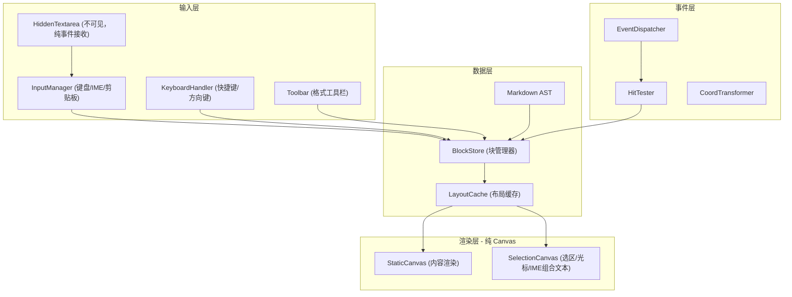
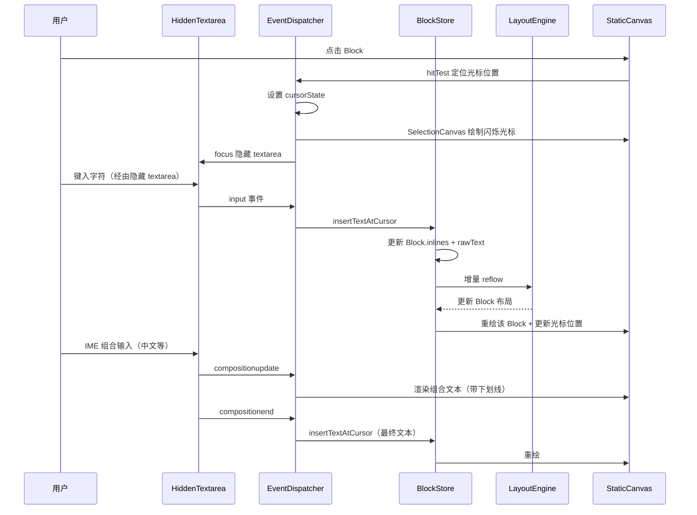
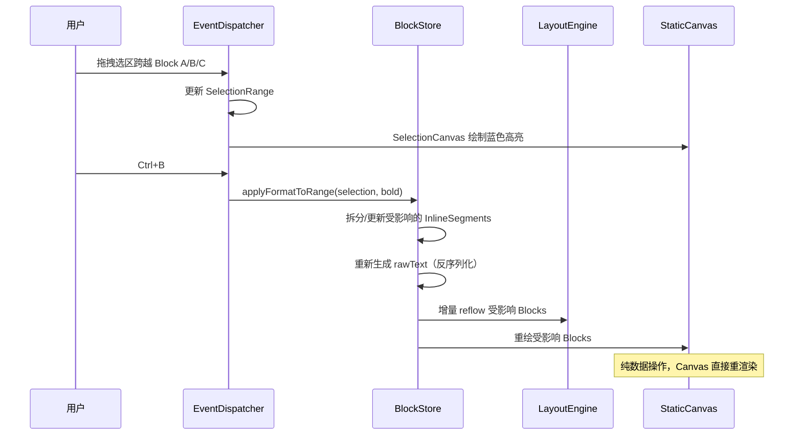
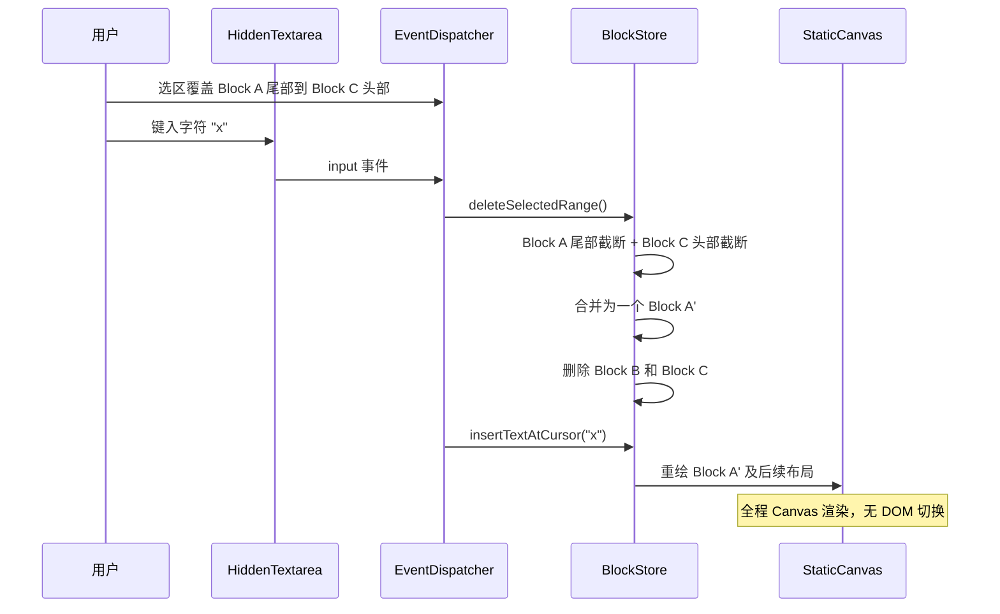

# Canvas Markdown 编辑器架构设计

## 一、核心设计理念

借鉴 Excalidraw 的架构经验，采用 **纯 Canvas 渲染 + 隐藏 textarea 输入** 的架构：

- **渲染层**全程使用 Canvas 绘制 Markdown 的最终效果（标题大号粗体、列表缩进、代码块背景等），包括光标和选区
- **输入层**使用一个不可见的 textarea 作为纯事件接收器，捕获键盘输入、IME 组合和剪贴板操作，不参与任何渲染
- **数据层**所有编辑操作直接修改数据模型（Block + InlineSegment），Canvas 根据数据重渲染

## 二、整体架构




## 三、数据模型：Block 体系

不同于 Excalidraw 用扁平的元素列表，Markdown 编辑器应采用 **Block（块）** 作为基本单位：

```typescript
interface Block {
  id: string;
  type: 'heading' | 'paragraph' | 'list' | 'code' | 'quote' | 'hr' | 'image' | 'table';
  // 块在文档中的顺序
  index: number;
  // 块的 Markdown 原始文本
  rawText: string;
  // 块内的内联样式片段（解析后）
  inlines: InlineSegment[];
  // 布局计算结果（缓存）
  layout: BlockLayout | null;
  // 版本号（变化检测）
  version: number;
}

interface InlineSegment {
  text: string;
  style: {
    bold: boolean;
    italic: boolean;
    code: boolean;
    link: string | null;
    strikethrough: boolean;
  };
  // 在该块内的字符偏移
  offset: number;
  length: number;
}

interface BlockLayout {
  // 块在文档中的绝对 Y 坐标
  y: number;
  // 块的总高度
  height: number;
  // 块内每行的布局信息
  lines: LineLayout[];
}

interface LineLayout {
  y: number;          // 行的 Y 坐标（相对文档）
  height: number;     // 行高
  segments: SegmentLayout[];  // 行内每个样式片段的位置
}

interface SegmentLayout {
  x: number;
  width: number;
  text: string;
  font: string;       // 计算后的 CSS font string
  color: string;
}
```

### 与 Excalidraw 的对比


| 概念   | Excalidraw            | Markdown 编辑器        |
| ---- | --------------------- | ------------------- |
| 基本单位 | Element (矩形/椭圆/文字...) | Block (段落/标题/列表...) |
| 布局   | 自由定位 (x, y)           | 线性文档流 (仅 y 坐标)      |
| 管理器  | Scene                 | BlockStore          |
| 变化检测 | sceneNonce            | block.version       |
| 缓存失效 | ShapeCache (WeakMap)  | LayoutCache (Map)   |


## 四、渲染层设计

### 4.1 双层 Canvas（借鉴 Excalidraw 的三层方案简化）

```
┌─────────────────────────────────────────┐
│  Container                              │
│  ┌───────────────────────────────────┐  │
│  │ StaticCanvas (z-index: 1)         │  │
│  │   渲染 Markdown 内容              │  │
│  │   pointer-events: none            │  │
│  ├───────────────────────────────────┤  │
│  │ SelectionCanvas (z-index: 2)      │  │
│  │   渲染光标、选区高亮              │  │
│  │   接收所有指针事件                │  │
│  ├───────────────────────────────────┤  │
│  │ WYSIWYG textarea (z-index: 3)     │  │
│  │   编辑时出现，精确覆盖            │  │
│  └───────────────────────────────────┘  │
└─────────────────────────────────────────┘
```

### 4.2 StaticCanvas 渲染流程

```typescript
function renderStaticScene(ctx, blocks, viewport, dpr) {
  // 1. DPR 缩放
  ctx.setTransform(1, 0, 0, 1, 0, 0);
  ctx.scale(dpr, dpr);

  // 2. 清空 + 填充背景
  ctx.fillStyle = '#ffffff';
  ctx.fillRect(0, 0, width, height);

  // 3. 应用滚动偏移
  ctx.translate(0, -viewport.scrollY);

  // 4. 只渲染可见块（视口裁剪）
  const visibleBlocks = getVisibleBlocks(blocks, viewport);

  for (const block of visibleBlocks) {
    renderBlock(ctx, block);
  }
}

function renderBlock(ctx, block) {
  switch (block.type) {
    case 'heading':
      renderHeading(ctx, block);   // 大号粗体
      break;
    case 'paragraph':
      renderParagraph(ctx, block); // 混合内联样式
      break;
    case 'code':
      renderCodeBlock(ctx, block); // 背景色 + 等宽字体
      break;
    case 'list':
      renderList(ctx, block);     // 缩进 + 项目符号/序号
      break;
    case 'quote':
      renderQuote(ctx, block);    // 左侧竖线 + 灰色文字
      break;
    case 'hr':
      renderHorizontalRule(ctx, block); // 水平线
      break;
  }
}
```

### 4.3 各 Block 类型的渲染策略


| Block 类型     | 字体              | 特殊绘制                 |
| ------------ | --------------- | -------------------- |
| heading (h1) | 32px bold       | 底部分隔线                |
| heading (h2) | 24px bold       | 底部分隔线                |
| heading (h3) | 20px bold       | 无                    |
| paragraph    | 16px normal     | 内联样式混排               |
| code         | 14px monospace  | 背景矩形 (fillRect) + 圆角 |
| list (ul)    | 16px normal     | 圆点/方块前缀 + 缩进         |
| list (ol)    | 16px normal     | 数字前缀 + 缩进            |
| quote        | 16px normal, 灰色 | 左侧 4px 竖线 (fillRect) |
| hr           | 无文字             | 居中 1px 水平线           |
| table        | 14px normal     | 网格线 (strokeRect)     |


### 4.4 内联样式渲染

一个段落内可能混合多种样式（粗体、斜体、代码、链接），需要**逐片段绘制**：

```typescript
function renderInlineSegments(ctx, segments, startX, y) {
  let x = startX;
  for (const seg of segments) {
    ctx.font = buildFont(seg.style);  // "bold italic 16px sans-serif"
    ctx.fillStyle = seg.style.link ? '#0366d6' : '#333';

    if (seg.style.code) {
      // 行内代码：绘制背景
      const w = ctx.measureText(seg.text).width;
      ctx.fillStyle = '#f0f0f0';
      ctx.fillRect(x - 2, y - fontSize, w + 4, fontSize + 4);
      ctx.fillStyle = '#e83e8c';
    }

    ctx.fillText(seg.text, x, y);

    if (seg.style.link) {
      // 链接：绘制下划线
      const w = ctx.measureText(seg.text).width;
      ctx.strokeStyle = '#0366d6';
      ctx.beginPath();
      ctx.moveTo(x, y + 2);
      ctx.lineTo(x + w, y + 2);
      ctx.stroke();
    }

    x += ctx.measureText(seg.text).width;
  }
}
```

## 五、布局引擎

### 5.1 文档流布局

与 Excalidraw 的自由定位不同，Markdown 是线性文档流，布局更简单：

```typescript
class LayoutEngine {
  private textMeasurer: CanvasTextMeasurer;

  // 从第 startIndex 个块开始重新计算布局
  reflow(blocks: Block[], startIndex: number, containerWidth: number) {
    let y = startIndex > 0
      ? blocks[startIndex - 1].layout!.y + blocks[startIndex - 1].layout!.height
      : 0;

    for (let i = startIndex; i < blocks.length; i++) {
      const block = blocks[i];
      // 如果布局缓存有效，直接复用
      if (block.layout && block.layout.y === y) {
        y += block.layout.height;
        continue;
      }
      // 否则重新计算
      block.layout = this.computeBlockLayout(block, y, containerWidth);
      y += block.layout.height;
    }
  }

  private computeBlockLayout(block, y, width): BlockLayout {
    const font = getFontForBlock(block);
    const padding = getPaddingForBlock(block);
    const lineHeight = getLineHeightForBlock(block);

    // 文本自动换行
    const wrappedLines = this.wrapText(block.inlines, width - padding.left - padding.right, font);

    const lines: LineLayout[] = wrappedLines.map((line, i) => ({
      y: y + padding.top + i * lineHeight,
      height: lineHeight,
      segments: line.segments,
    }));

    return {
      y,
      height: padding.top + lines.length * lineHeight + padding.bottom + block.marginBottom,
      lines,
    };
  }
}
```

### 5.2 增量布局

编辑时只需从被修改的 Block 开始重新计算布局，之前的块不受影响（仅 y 坐标需要级联更新）。这比 Excalidraw 的全量场景更新更高效，因为文档流布局是线性的。

## 六、编辑交互设计

### 6.1 点击定位（Hit Testing）

Markdown 编辑器的 hit testing 比 Excalidraw 简单得多，因为布局是线性的：

```typescript
class HitTester {
  // O(log n) 二分查找 Block
  hitBlock(y: number, blocks: Block[]): Block | null {
    let lo = 0, hi = blocks.length - 1;
    while (lo <= hi) {
      const mid = (lo + hi) >> 1;
      const layout = blocks[mid].layout!;
      if (y < layout.y) hi = mid - 1;
      else if (y > layout.y + layout.height) lo = mid + 1;
      else return blocks[mid];
    }
    return null;
  }

  // 在 Block 内定位到具体行和字符位置
  hitPosition(sceneX: number, sceneY: number, blocks: Block[]): CursorPosition | null {
    const block = this.hitBlock(sceneY, blocks);
    if (!block) return null;

    // 1. 找到行
    const line = block.layout!.lines.find(l => sceneY >= l.y && sceneY < l.y + l.height);
    if (!line) return null;

    // 2. 在行内逐片段二分查找字符位置
    let charIndex = 0;
    for (const seg of line.segments) {
      if (sceneX < seg.x + seg.width) {
        // 在这个片段内，精确定位字符
        charIndex += this.getCharIndexAtX(seg, sceneX);
        break;
      }
      charIndex += seg.text.length;
    }

    return { blockId: block.id, lineIndex, charIndex };
  }
}
```

**与 Excalidraw 的 O(n) 遍历对比**：由于文档流布局的 Block 按 y 坐标有序排列，可以用**二分查找** O(log n) 定位到 Block，性能更好。

### 6.2 纯 Canvas 编辑方案

所有编辑效果直接渲染在 Canvas 上，**不使用 contenteditable 或可见的 textarea 覆盖层**。用户编辑的是渲染后的 Markdown 效果（所见即所得），且全程在 Canvas 中完成。

#### 架构：隐藏 textarea + Canvas 渲染

浏览器不允许 Canvas 直接接收 IME 组合事件（中文/日文等输入法），因此需要一个**不可见的 textarea** 作为纯输入事件接收器（类似 Google Sheets 的做法）。这个 textarea 对用户完全不可见，不参与任何渲染。

```
┌─────────────────────────────────────────────┐
│  Canvas 容器                                  │
│  ┌───────────────────────────────────────┐   │
│  │  StaticCanvas     (文本 + 样式渲染)      │   │
│  │  ┌─────────────────────────────┐      │   │
│  │  │ # Hello World              │      │   │
│  │  │ 这是一段 **加粗** 文字  |      │      │   │
│  │  │                     ↑ 光标   │      │   │
│  │  └─────────────────────────────┘      │   │
│  ├───────────────────────────────────────┤   │
│  │  SelectionCanvas  (光标 + 选区高亮)      │   │
│  └───────────────────────────────────────┘   │
│                                               │
│  <textarea                                    │
│    style="opacity:0; position:absolute;       │
│           width:1px; height:1px;              │
│           pointer-events:none;"               │
│    ← 隐藏的输入接收器，仅用于 IME 和剪贴板     │
│  />                                           │
└─────────────────────────────────────────────┘
```

#### 输入事件处理

```typescript
class InputManager {
  private hiddenTextarea: HTMLTextAreaElement;
  private isComposing = false;

  constructor(private canvas: HTMLCanvasElement) {
    this.hiddenTextarea = document.createElement('textarea');
    Object.assign(this.hiddenTextarea.style, {
      position: 'absolute',
      opacity: '0',
      width: '1px',
      height: '1px',
      overflow: 'hidden',
      pointerEvents: 'none',
    });
    canvas.parentElement!.appendChild(this.hiddenTextarea);

    this.hiddenTextarea.addEventListener('input', this.onInput);
    this.hiddenTextarea.addEventListener('compositionstart', this.onCompositionStart);
    this.hiddenTextarea.addEventListener('compositionupdate', this.onCompositionUpdate);
    this.hiddenTextarea.addEventListener('compositionend', this.onCompositionEnd);
    this.hiddenTextarea.addEventListener('copy', this.onCopy);
    this.hiddenTextarea.addEventListener('paste', this.onPaste);

    canvas.addEventListener('pointerdown', () => this.hiddenTextarea.focus());
  }

  private onInput = (e: InputEvent) => {
    if (this.isComposing) return; // IME 组合中，等 compositionend
    const text = this.hiddenTextarea.value;
    this.hiddenTextarea.value = ''; // 清空，准备下次输入
    if (text) {
      this.insertText(text);
    }
  };

  private onCompositionStart = () => {
    this.isComposing = true;
  };

  private onCompositionUpdate = (e: CompositionEvent) => {
    // 在 Canvas 上渲染 IME 组合中的临时文本（带下划线）
    this.renderCompositionText(e.data);
  };

  private onCompositionEnd = (e: CompositionEvent) => {
    this.isComposing = false;
    this.hiddenTextarea.value = '';
    this.insertText(e.data); // 提交最终文本
    this.clearCompositionText();
  };

  private insertText(text: string) {
    // 在当前光标位置插入文本到数据模型
    blockStore.insertTextAtCursor(cursor, text);
    // 触发增量布局 + Canvas 重渲染
    layoutEngine.reflowFrom(cursor.blockId);
    renderer.invalidate();
  }
}
```

#### Canvas 上的光标渲染

```typescript
class CursorRenderer {
  private visible = true;
  private blinkTimer: number;

  constructor(private ctx: CanvasRenderingContext2D) {
    this.blinkTimer = setInterval(() => {
      this.visible = !this.visible;
      this.render();
    }, 530);
  }

  render() {
    const pos = this.getCursorPixelPosition();
    if (!pos || !this.visible) return;

    this.ctx.clearRect(0, 0, this.ctx.canvas.width, this.ctx.canvas.height);
    this.ctx.fillStyle = '#000';
    this.ctx.fillRect(pos.x, pos.y, 2, pos.height);
  }

  private getCursorPixelPosition(): { x: number; y: number; height: number } | null {
    const { blockId, offset } = cursorState;
    const block = blockStore.getBlock(blockId);
    if (!block?.layout) return null;

    // 遍历行和段找到光标所在的像素位置
    for (const line of block.layout.lines) {
      let charCount = 0;
      for (const seg of line.segments) {
        if (charCount + seg.text.length >= offset) {
          const charInSeg = offset - charCount;
          const textBefore = seg.text.substring(0, charInSeg);
          const x = seg.x + textMeasurer.measureWidth(textBefore, seg.style);
          return { x, y: line.y, height: line.height };
        }
        charCount += seg.text.length;
      }
    }
    return null;
  }
}
```

#### Canvas 上的 IME 组合文本渲染

```typescript
function renderCompositionText(
  ctx: CanvasRenderingContext2D,
  compositionText: string,
  cursorPos: { x: number; y: number; height: number },
  style: InlineStyle
) {
  const font = buildCanvasFont(style);
  ctx.font = font;
  ctx.fillStyle = '#000';
  ctx.fillText(compositionText, cursorPos.x, cursorPos.y + cursorPos.height * 0.85);

  // IME 组合文本下方的虚线下划线
  const textWidth = ctx.measureText(compositionText).width;
  ctx.setLineDash([2, 2]);
  ctx.strokeStyle = '#000';
  ctx.beginPath();
  ctx.moveTo(cursorPos.x, cursorPos.y + cursorPos.height);
  ctx.lineTo(cursorPos.x + textWidth, cursorPos.y + cursorPos.height);
  ctx.stroke();
  ctx.setLineDash([]);
}
```

#### 键盘事件处理（非 IME 输入）

```typescript
class KeyboardHandler {
  constructor(private canvas: HTMLCanvasElement) {
    canvas.addEventListener('keydown', this.onKeyDown);
  }

  private onKeyDown = (e: KeyboardEvent) => {
    // 格式快捷键
    if (e.ctrlKey || e.metaKey) {
      switch (e.key) {
        case 'b': e.preventDefault(); this.toggleFormat('bold'); return;
        case 'i': e.preventDefault(); this.toggleFormat('italic'); return;
        case 'z': e.preventDefault(); undoManager.undo(); return;
        case 'y': e.preventDefault(); undoManager.redo(); return;
        case 'a': e.preventDefault(); this.selectAll(); return;
      }
    }

    switch (e.key) {
      case 'ArrowLeft':  this.moveCursor(-1, e.shiftKey); break;
      case 'ArrowRight': this.moveCursor(+1, e.shiftKey); break;
      case 'ArrowUp':    this.moveCursorVertical(-1, e.shiftKey); break;
      case 'ArrowDown':  this.moveCursorVertical(+1, e.shiftKey); break;
      case 'Home':       this.moveCursorToLineStart(e.shiftKey); break;
      case 'End':        this.moveCursorToLineEnd(e.shiftKey); break;
      case 'Backspace':  e.preventDefault(); this.deleteBackward(); break;
      case 'Delete':     e.preventDefault(); this.deleteForward(); break;
      case 'Enter':      e.preventDefault(); this.insertNewBlock(); break;
      case 'Tab':        e.preventDefault(); this.handleTab(e.shiftKey); break;
    }
  };

  private moveCursor(direction: -1 | 1, extendSelection: boolean) {
    const newOffset = cursorState.offset + direction;
    // 处理跨 Block 边界
    if (newOffset < 0) {
      const prevBlock = blockStore.getPrevBlock(cursorState.blockId);
      if (prevBlock) {
        cursorState.blockId = prevBlock.id;
        cursorState.offset = getBlockTextLength(prevBlock);
      }
    } else if (newOffset > getBlockTextLength(currentBlock)) {
      const nextBlock = blockStore.getNextBlock(cursorState.blockId);
      if (nextBlock) {
        cursorState.blockId = nextBlock.id;
        cursorState.offset = 0;
      }
    } else {
      cursorState.offset = newOffset;
    }

    if (extendSelection) {
      selectionState.focus = { ...cursorState };
    } else {
      selectionState = null;
    }

    renderer.invalidateSelection();
  }

  private deleteBackward() {
    if (selectionState) {
      deleteSelectedRange(selectionState);
      selectionState = null;
      return;
    }
    if (cursorState.offset === 0) {
      // 光标在 Block 开头 → 与上一个 Block 合并
      const prevBlock = blockStore.getPrevBlock(cursorState.blockId);
      if (prevBlock) {
        const mergeOffset = getBlockTextLength(prevBlock);
        mergeBlocks(prevBlock, currentBlock);
        cursorState = { blockId: prevBlock.id, offset: mergeOffset };
      }
    } else {
      // 删除光标前一个字符
      blockStore.deleteCharAt(cursorState.blockId, cursorState.offset - 1);
      cursorState.offset--;
    }
    layoutEngine.reflowFrom(cursorState.blockId);
    renderer.invalidate();
  }

  private toggleFormat(format: 'bold' | 'italic' | 'code' | 'strikethrough') {
    if (!selectionState) return;
    applyFormatToRange(blockStore.blocks, selectionState, { [format]: true });
    renderer.invalidate();
  }
}
```

#### 与 Excalidraw WYSIWYG 方案的对比


| 方面     | Excalidraw（textarea 覆盖）     | 本方案（纯 Canvas + 隐藏 textarea）         |
| ------ | --------------------------- | ----------------------------------- |
| 文本渲染   | 编辑时 Canvas 隐藏文本，textarea 显示 | 全程 Canvas 渲染，无可见 DOM                |
| 光标/选区  | textarea 原生光标               | Canvas 自绘光标和选区高亮                    |
| IME 支持 | textarea 原生处理               | 隐藏 textarea 接收 IME 事件，Canvas 渲染组合文本 |
| 跨块编辑   | 不涉及（单元素编辑）                  | 完整支持跨 Block 选区和操作                   |
| 样式一致性  | 需要 textarea 样式精确匹配 Canvas   | 无此问题，全程同一 Canvas 渲染                 |
| 实现复杂度  | 低（利用浏览器原生能力）                | 高（需自行实现光标、选区、IME 渲染）                |
| 渲染流畅度  | 切换编辑时有 DOM↔Canvas 切换闪烁      | 无任何切换，始终流畅                          |


### 6.3 跨 Block 选区与编辑

这是与 Excalidraw 最大的架构差异。Excalidraw 的元素彼此独立，而 Markdown 文档是连续文本流，用户经常跨块选择内容。

#### 选区数据模型

```typescript
interface SelectionRange {
  anchor: CursorPosition;  // 选区起点（鼠标按下时）
  focus: CursorPosition;   // 选区终点（鼠标当前位置）
}

interface CursorPosition {
  blockId: string;
  offset: number;  // 在 Block 纯文本中的字符偏移量
}
```

选区可以是：

- **同块选区**：anchor 和 focus 在同一个 Block
- **跨块选区**：anchor 和 focus 在不同 Block，中间所有 Block 都被完整选中

#### 选区渲染（Canvas）

选区高亮和光标全部在 **SelectionCanvas** 上绘制，不使用 DOM：

```typescript
function renderSelection(ctx: CanvasRenderingContext2D, selection: SelectionRange, blocks: Block[]) {
  const selectedBlocks = getBlocksInRange(selection, blocks);

  for (const block of selectedBlocks) {
    const layout = block.layout!;

    if (block === firstBlock) {
      // 第一个块：从 anchor offset 到行尾
      highlightFromOffset(ctx, layout, selection.anchor.offset, 'end');
    } else if (block === lastBlock) {
      // 最后一个块：从行首到 focus offset
      highlightFromOffset(ctx, layout, 0, selection.focus.offset);
    } else {
      // 中间块：整块高亮
      ctx.fillStyle = 'rgba(59, 130, 246, 0.3)';
      ctx.fillRect(layout.x, layout.y, layout.width, layout.height);
    }
  }
}
```

#### 编辑操作分发

跨块编辑的核心原则：**字符输入始终在单 Block 内，批量操作直接操作数据模型。**

```
用户有跨块选区时：

1. 键入字符 / IME 输入：
   → 先执行 deleteSelectedRange()（数据层操作）
   → 合并首尾 Block 为一个 Block
   → 光标落在合并后的 Block 中
   → 隐藏 textarea 接收输入，Canvas 直接渲染

2. Ctrl+B（加粗）：
   → 遍历选区覆盖的所有 InlineSegment
   → 按选区边界拆分 segment，对选中部分设置 bold: true
   → Canvas 重新渲染受影响的 Block（无需 DOM）

3. Delete / Backspace：
   → deleteSelectedRange()：删除选中内容
   → 合并首尾 Block（如果跨块）
   → Canvas 重新渲染

4. 粘贴：
   → 解析剪贴板 Markdown
   → deleteSelectedRange()（如果有选区）
   → 在光标位置插入新 Block(s)
   → 可能拆分当前 Block

5. 复制：
   → 收集选区内所有 Block 的 Markdown 源码
   → 写入剪贴板
```

#### 数据层操作：deleteSelectedRange

```typescript
function deleteSelectedRange(blocks: Block[], selection: SelectionRange): CursorPosition {
  const { anchor, focus } = normalizeSelection(selection); // 确保 anchor 在前
  const startBlock = getBlock(anchor.blockId);
  const endBlock = getBlock(focus.blockId);

  if (startBlock === endBlock) {
    // 同块删除：移除 offset 范围内的文本
    spliceInlineContent(startBlock, anchor.offset, focus.offset);
    return anchor;
  }

  // 跨块删除：
  // 1. startBlock 保留 anchor.offset 之前的内容
  truncateAfter(startBlock, anchor.offset);
  // 2. endBlock 保留 focus.offset 之后的内容
  truncateBefore(endBlock, focus.offset);
  // 3. 合并 endBlock 剩余内容到 startBlock
  mergeInlines(startBlock, endBlock);
  // 4. 删除中间所有 Block 和 endBlock
  removeBlocksBetween(startBlock, endBlock);
  removeBlock(endBlock);
  // 5. 触发从 startBlock 开始的增量重排
  layoutEngine.reflowFrom(startBlock);

  return anchor;
}
```

#### 格式化操作：applyFormatToRange

```typescript
function applyFormatToRange(
  blocks: Block[],
  selection: SelectionRange,
  format: Partial<InlineStyle>
) {
  const affectedBlocks = getBlocksInRange(selection, blocks);

  for (const block of affectedBlocks) {
    const [startOffset, endOffset] = getOffsetsForBlock(block, selection);
    // 在 offset 边界处拆分 InlineSegment
    splitSegmentAt(block, startOffset);
    splitSegmentAt(block, endOffset);
    // 对范围内的 segments 应用格式
    for (const seg of getSegmentsInRange(block, startOffset, endOffset)) {
      Object.assign(seg.style, format);
    }
    // 合并相邻的同样式 segment
    mergeAdjacentSegments(block);
  }

  // Canvas 重新渲染受影响的 Block
  renderer.invalidateBlocks(affectedBlocks);
}
```

#### 编辑操作统一分发表


| 场景            | 方式                                                                    |
| ------------- | --------------------------------------------------------------------- |
| 点击 Block      | Canvas 绘制光标，隐藏 textarea 获得焦点准备接收输入                                    |
| 键入字符          | 隐藏 textarea → InputManager.onInput → 数据模型更新 → Canvas 重渲染              |
| IME 输入        | 隐藏 textarea → compositionupdate → Canvas 渲染组合文本 → compositionend → 提交 |
| 跨块选区后键入字符     | 先 deleteSelectedRange → 光标定位 → 同上键入流程                                 |
| 跨块选区后按 Ctrl+B | 纯数据操作 applyFormatToRange → Canvas 直接重渲染                               |
| 跨块选区后按 Delete | 纯数据操作 deleteSelectedRange → Canvas 重渲染                                |


全程无可见 DOM 元素参与渲染，光标和选区高亮始终由 SelectionCanvas 绘制。

## 七、数据流

### 7.1 单 Block 编辑流程




### 7.2 跨 Block 格式化流程（如 Ctrl+B 加粗）




### 7.3 跨 Block 删除后输入流程




## 八、关键模块清单


| 模块                 | 职责                                    | 对应 Excalidraw                     |
| ------------------ | ------------------------------------- | --------------------------------- |
| `BlockStore`       | 管理所有 Block，增删改查，变化通知                  | `Scene`                           |
| `MarkdownParser`   | 解析 Markdown 文本为 Block + InlineSegment | 无（Excalidraw 不需要解析文本格式）           |
| `LayoutEngine`     | 计算每个 Block 的布局（y, height, 行信息）        | `Renderer.getRenderableElements`  |
| `TextMeasurer`     | 离屏 Canvas 测量文本宽度（带缓存）                 | `textMeasurements.ts`             |
| `StaticCanvas`     | 渲染 Markdown 内容                        | `StaticCanvas`                    |
| `SelectionCanvas`  | 渲染光标和选区                               | `InteractiveCanvas`               |
| `InputManager`     | 隐藏 textarea 管理：接收键盘/IME/剪贴板事件         | `textWysiwyg.tsx`（思路不同）           |
| `CursorRenderer`   | Canvas 光标渲染（闪烁、定位）                    | 无（Excalidraw 用 textarea 原生光标）     |
| `KeyboardHandler`  | 键盘事件处理：快捷键、方向键、删除、回车等                 | `App.onKeyDown`                   |
| `HitTester`        | 点击定位到 Block/行/字符                      | `collision.ts` + `App.hitElement` |
| `CoordTransformer` | 浏览器坐标 ↔ 文档坐标转换                        | `viewportCoordsToSceneCoords`     |
| `EventDispatcher`  | 事件派发和路由                               | `App.handleCanvasPointerDown` 等   |
| `ScrollManager`    | 滚动管理（滚轮、拖拽滚动条）                        | `App.handleWheel`                 |
| `Toolbar`          | 格式工具栏（加粗、斜体、标题等级...）                  | 无直接对应                             |


## 九、性能优化策略


| 策略                | 说明                               |
| ----------------- | -------------------------------- |
| Block 布局缓存        | 未变化的 Block 不重新计算布局               |
| 增量 reflow         | 只从修改点开始向下重算，不全量计算                |
| 视口裁剪              | 只渲染可见区域的 Block                   |
| 文本测量缓存            | 相同 font + text 组合缓存测量结果          |
| 双层 Canvas         | 内容和选区分离，选区变化不重绘内容                |
| DPR 处理            | `context.scale(dpr)` 确保高分屏清晰     |
| Canvas 自绘光标/选区    | 光标闪烁、选区高亮、IME 组合文本全部在 Canvas 上渲染 |
| O(log n) hit test | Block 按 y 有序，可二分查找               |


## 十、技术选型建议


| 技术          | 推荐                                      |
| ----------- | --------------------------------------- |
| Markdown 解析 | `marked` 或 `remark`（生成 AST）             |
| 文本测量        | 离屏 Canvas `measureText()`（同 Excalidraw） |
| 状态管理        | `zustand` 或自建 EventEmitter（轻量）          |
| UI 框架       | React（工具栏、弹窗等 DOM 部分）                   |
| 构建工具        | Vite                                    |


## 十一、与纯 DOM 方案的关键差异


| 方面   | DOM Markdown 编辑器                      | Canvas Markdown 编辑器              |
| ---- | ------------------------------------- | -------------------------------- |
| 渲染   | `dangerouslySetInnerHTML` 或 React 组件树 | Canvas `fillText` + `fillRect`   |
| 文本编辑 | `contenteditable` 或 textarea          | 隐藏 textarea 接收输入，Canvas 直接渲染编辑效果 |
| 选区   | 浏览器原生 Selection API                   | 自行实现 + SelectionCanvas 绘制        |
| 滚动   | 浏览器原生滚动                               | 自行实现（Canvas 不滚动，通过 translate 偏移） |
| 开发成本 | 低（2-4 周）                              | 高（2-4 月）                         |
| 适用场景 | 中小规模文档                                | 超长文档 / 需要极致渲染性能                  |


**总结**：Canvas Markdown 编辑器的核心思路是 "**数据驱动 + Block 化 + 增量布局 + 纯 Canvas 渲染**"。借鉴 Excalidraw 的 Scene/Renderer/Canvas 分层架构，但做了关键差异化：自由定位改为文档流布局，Element 改为 Block，O(n) hit test 优化为 O(log n) 二分查找，textarea 覆盖编辑改为隐藏 textarea + Canvas 直接渲染的全 Canvas 方案。