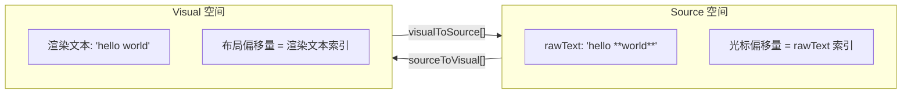

# 实时内联 Markdown 解析集成计划

## 当前状态

上一轮对话中已更新的文件：

- [types.ts](canvas-markdown-editor/src/core/types.ts) - `Block` 新增 `sourceToVisual[]` 和 `visualToSource[]` 字段
- [BlockStore.ts](canvas-markdown-editor/src/core/BlockStore.ts) - 以 `rawText` 为数据源重写，新增 `reparseBlock()`、转换辅助方法
- [MarkdownParser.ts](canvas-markdown-editor/src/core/MarkdownParser.ts) - 使用 `InlineParser.parseInlineMarkdown()`
- [InlineParser.ts](canvas-markdown-editor/src/core/InlineParser.ts) - 已完成，生成 segments + 双向偏移映射表
- [HitTester.ts](canvas-markdown-editor/src/core/HitTester.ts) - 已更新，构造函数需要 `blockStore` 做 visual->source 转换

### 当前报错

点击画布时报错：`Uncaught TypeError: Cannot read properties of undefined (reading 'visualToSource')`

**原因**：`HitTester` 构造函数已改为需要 `blockStore` 参数，但 `App.tsx` 第 35 行仍用旧写法：

```typescript
const hitTester = new HitTester(textMeasurer); // 缺少 blockStore 参数
```

导致 `this.blockStore` 为 `undefined`，调用 `this.blockStore.visualToSource()` 时报错。

## 核心概念：两个坐标空间




- **Source 空间**：`block.rawText` 中的偏移量（如 `"hello **world**"` = 15 字符）。光标、数据操作、所有 `CursorPosition.offset` 均在此空间。
- **Visual 空间**：不含标记符的渲染文本中的偏移量（如 `"hello world"` = 11 字符）。布局 segments、渲染、命中测试均在此空间。

转换点：


| 操作       | 转换方向                                       | 说明             |
| -------- | ------------------------------------------ | -------------- |
| 渲染光标/选区  | source -> visual                           | 根据布局找像素位置      |
| 命中测试     | visual -> source                           | HitTester 中已完成 |
| 上下键/行首行尾 | source -> visual -> 计算 -> visual -> source | 需要双向转换         |
| 左右键      | source 空间内跳过标记符                            | 防止光标"卡"在不可见字符上 |


## 编译错误

1. `getBlockTextLength` 已从 `BlockStore` 中移除（改为 `getRawTextLength`），以下位置仍在使用：
  - `KeyboardHandler.ts` 第 71, 85, 213, 254 行
  - `App.tsx` 第 147 行
2. `parser.parseInlineStyles()` 已从 `MarkdownParser` 中移除，仍在使用：
  - `MarkdownShortcuts.ts` 第 44 行

## 逐模块修改方案

### 1. KeyboardHandler.ts - Source/Visual 光标导航

**编译修复**：将所有 `getBlockTextLength` 替换为 `getRawTextLength`（4 处）

**左右键移动**（`moveCursor`）：新增标记符跳过逻辑。计算出新 source 偏移量后，检查 `sourceToVisual[newOffset]` 是否与 `sourceToVisual[oldOffset]` 相同。若相同则继续沿同方向推进，直到 visual 位置发生变化。防止光标在不可见的标记字符上"卡住"。

```typescript
// 示例：向右移动时跳过标记符
let newOffset = cursor.offset + 1;
const oldVisual = blockStore.sourceToVisual(block, cursor.offset);
while (newOffset < rawLen && blockStore.sourceToVisual(block, newOffset) === oldVisual) {
  newOffset++;
}
```

**上下键移动**（`moveCursorVertical`、`moveCursorToLineEdge`）：`getLineInfo` 和 `getOffsetAtLineStart` 方法基于 visual 布局 segments 工作。需先将光标的 source 偏移转为 visual 偏移，计算完成后再转回 source 偏移。

```typescript
// moveCursorVertical 中：
const visualOffset = blockStore.sourceToVisual(block, cursor.offset);
const { lineIndex, offsetInLine } = this.getLineInfo(block, visualOffset);
// ...计算目标 visual 偏移...
const targetVisualOffset = prevLinesOffset + targetOffset;
const newSourceOffset = blockStore.visualToSource(block, targetVisualOffset);
```

**handleDelete 合并**：将直接操作 `inlines` 替换为 `rawText` 拼接 + `reparseBlock`：

```typescript
block.rawText = block.rawText + next.rawText;
this.blockStore.reparseBlock(block);
```

### 2. SelectionCanvasRenderer.ts - 用 Visual 偏移量渲染

构造函数新增 `BlockStore` 参数。

`**getCursorPixelPosition**`：将 `cursor.offset`（source）转为 visual 偏移量后再遍历布局 segments：

```typescript
const block = blocks.find(b => b.id === cursor.blockId);
const visualOffset = this.blockStore.sourceToVisual(block, cursor.offset);
// 用 visualOffset（而非 cursor.offset）查找像素位置
```

`**highlightRange**`：将 `startOffset`、`endOffset` 从 source 转为 visual 后再与 segment 字符数比较。

`**renderSelectionHighlight**`：`anchor.offset` 和 `focus.offset` 均为 source 偏移量，传入 `highlightRange` 前需转为 visual。

### 3. App.tsx - 统一串联

- **修复报错**：`HitTester` 实例化传入 `blockStore`：`new HitTester(textMeasurer, blockStore)`
- `SelectionCanvasRenderer` 实例化传入 `blockStore`
- `deleteSelectedRange` 中 `getBlockTextLength` 替换为 `getRawTextLength`
- `deleteSelectedRange` 中跨块合并逻辑：`rawText` 拼接 + `blockStore.reparseBlock()`，替代直接操作 `inlines`
- `getSelectedText`：用 `block.rawText.substring()` + source 偏移量，替代 `block.inlines.map().join('')`

### 4. MarkdownShortcuts.ts - 使用 rawText

- `block.inlines.map(s => s.text).join('')` 替换为 `block.rawText`
- `parser.parseInlineStyles(remaining)` 替换为直接设置 `block.rawText = remaining` 然后调用 `reparseBlock`
- 移除 `MarkdownParser` 导入，改用 `InlineParser` 的 `parseInlineMarkdown`
- 删除废弃的 `reParseInlines` 函数和 `parseInlineStylesWithMarkers` 函数

### 5. BlockSerializer.ts - 简化序列化

`block.rawText` 已包含 markdown 源码（含标记符），序列化只需加块类型前缀：

```typescript
export function blocksToMarkdown(blocks: readonly Block[]): string {
  return blocks.map(block => {
    switch (block.type) {
      case 'heading-1': return `# ${block.rawText}`;
      case 'heading-2': return `## ${block.rawText}`;
      case 'heading-3': return `### ${block.rawText}`;
      default: return block.rawText;
    }
  }).join('\n');
}
```

## 边界情况：在标记符边界处输入

当光标处于样式文本与普通文本的视觉边界时（如 `**` 后、`world` 前），在不同 source 位置插入文本会产生不同结果：

- Source 位置 6（`**` 之前）：插入的文本为普通样式
- Source 位置 8（`**` 之后）：插入的文本在加粗区域内

左右键的标记符跳过逻辑决定光标落在哪个 source 位置。MVP 阶段，向右跳过标记符后光标会落在内容字符上（source 8 而非 6），意味着插入文本会继承加粗样式。这是更符合 WYSIWYG 直觉的行为。

## 验证清单

1. 构建成功，无 TypeScript 错误
2. 纯文本输入正常
3. 输入 `**bold**` 后闭合标记时显示加粗文本
4. 光标导航（方向键、Home/End）流畅，跳过标记符位置
5. 在标记符边界处 Backspace/Delete 正常
6. 块级快捷键（`#` ）仍正常工作
7. Raw Markdown 面板显示正确源码
8. 复制/粘贴保留正确文本

