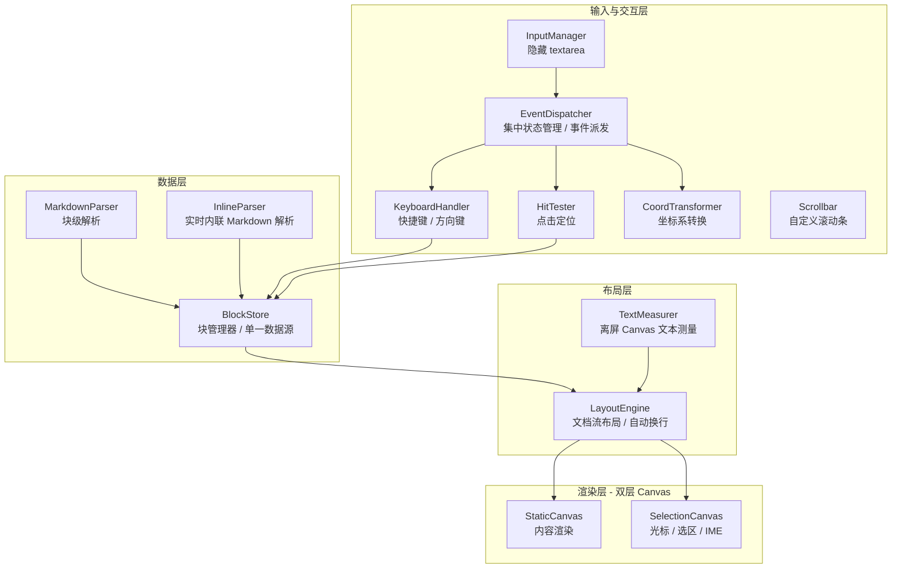
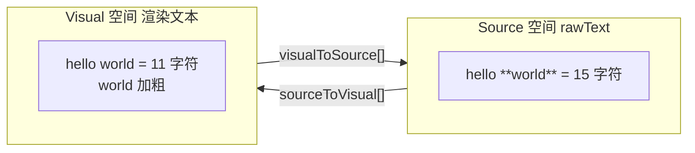
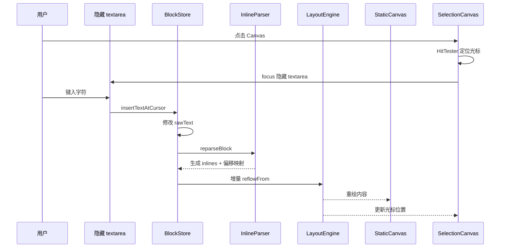
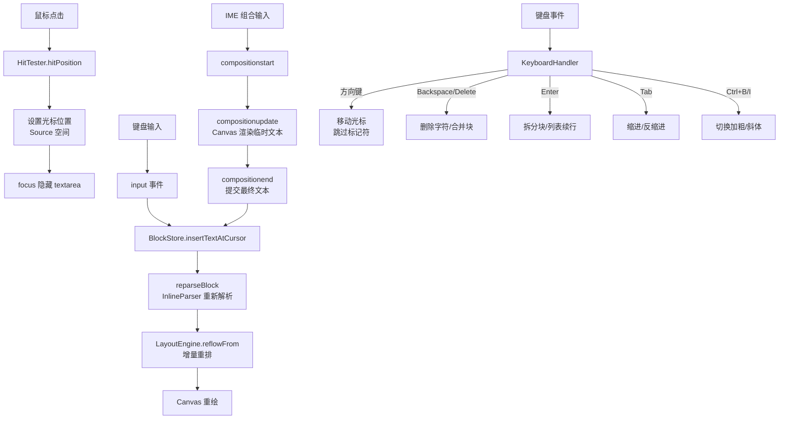
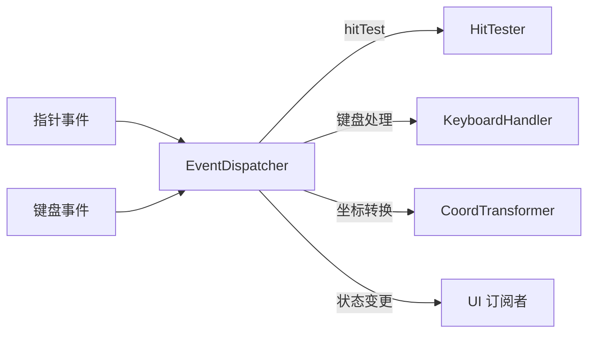

# Canvas Markdown Editor

基于纯 Canvas 渲染的所见即所得 (WYSIWYG) Markdown 编辑器。所有文本、光标、选区、IME 组合文本均在 Canvas 上绘制，不使用任何可见 DOM 元素参与内容渲染。

## 架构概览



## 核心设计理念

- **纯 Canvas 渲染**：全部内容通过 Canvas 2D API 绘制，包括光标闪烁、选区高亮、IME 组合文本
- **隐藏 textarea 输入**：一个不可见的 `<textarea>` 仅用于接收键盘事件、IME 组合和剪贴板操作
- **数据驱动**：所有编辑操作修改数据模型 (Block)，Canvas 根据数据重渲染
- **Source/Visual 双坐标空间**：光标和编辑操作在 Source 空间（含 Markdown 标记符），渲染和布局在 Visual 空间（不含标记符）

## 项目结构

```
src/
├── App.tsx                          # 主组件，集成所有模块
├── App.css                          # 布局与滚动条样式
├── core/
│   ├── types.ts                     # 核心类型定义
│   ├── BlockStore.ts                # 块数据管理器
│   ├── InlineParser.ts              # 实时内联 Markdown 解析
│   ├── MarkdownParser.ts            # 块级 Markdown 解析
│   ├── MarkdownShortcuts.ts         # 块级快捷键检测与应用
│   ├── BlockSerializer.ts           # Block -> Markdown 序列化
│   ├── TextMeasurer.ts              # 文本宽度测量（离屏 Canvas）
│   ├── LayoutEngine.ts              # 文档流布局引擎
│   ├── StaticCanvasRenderer.ts      # 静态内容渲染器
│   ├── SelectionCanvasRenderer.ts   # 光标 / 选区渲染器
│   ├── InputManager.ts              # 隐藏 textarea 管理
│   ├── KeyboardHandler.ts           # 键盘事件处理
│   ├── HitTester.ts                 # 点击位置 -> 光标定位
│   ├── CoordTransformer.ts          # 坐标系转换
│   └── EventDispatcher.ts           # 事件派发
```

## 数据模型

### Block 体系

编辑器以 **Block（块）** 为基本单位管理文档内容：

```typescript
interface Block {
  id: string;
  type: BlockType;         // 'paragraph' | 'heading-1' | ... | 'code-block' | 'hr'
  rawText: string;         // Markdown 源文本（含标记符），单一数据源
  inlines: InlineSegment[];// 解析后的内联样式片段（用于渲染）
  layout: BlockLayout | null;
  sourceToVisual: number[];// rawText 偏移 -> 渲染文本偏移
  visualToSource: number[];// 渲染文本偏移 -> rawText 偏移
}
```

支持的块类型：`paragraph`、`heading-1/2/3`、`bullet-list`、`ordered-list`、`code-block`、`blockquote`、`hr`

### Source/Visual 双坐标空间

这是编辑器最核心的设计之一。`rawText` 保留 Markdown 标记符作为数据源，渲染时解析为不含标记符的视觉文本。



| 操作 | 转换方向 | 说明 |
|------|----------|------|
| 渲染光标/选区 | source -> visual | 将光标 source 偏移转为像素位置 |
| 点击定位 | visual -> source | HitTester 从像素位置转回 source 偏移 |
| 上下键/行首行尾 | source -> visual -> 计算 -> source | 双向转换 |
| 左右键 | source 空间内跳过标记符 | 防止光标卡在不可见字符上 |

## 渲染架构

### 双层 Canvas

```
┌─────────────────────────────────────┐
│  editor-container                   │
│  ┌───────────────────────────────┐  │
│  │  StaticCanvas (z-index: 1)    │  │
│  │  渲染所有 Markdown 内容          │  │
│  ├───────────────────────────────┤  │
│  │  SelectionCanvas (z-index: 2) │  │
│  │  渲染光标、选区、IME 组合文本      │  │
│  │  接收所有指针事件               │  │
│  ├───────────────────────────────┤  │
│  │  Scrollbar (z-index: 10)      │  │
│  │  自定义滚动条                   │  │
│  └───────────────────────────────┘  │
│  <textarea style="opacity:0" />     │
│  隐藏输入接收器（IME / 剪贴板）       │
└─────────────────────────────────────┘
```

- **StaticCanvas**：渲染文档内容（标题、段落、列表、代码块等），仅在数据变化时重绘
- **SelectionCanvas**：渲染光标（530ms 闪烁）、选区高亮、IME 组合文本（带虚线下划线），高频更新不影响内容层

### 渲染流程



## 布局引擎

`LayoutEngine` 将 Block 数据转换为可渲染的空间信息：

- **文档流布局**：Block 按顺序纵向排列，每个 Block 的 y 坐标由前一个 Block 的底部决定
- **自动换行**：根据容器宽度和 `TextMeasurer` 的字符宽度数据，将文本拆分为多行
- **增量重排**：仅从修改的 Block 开始向下重新计算，未修改的 Block 保持缓存
- **块类型特殊处理**：列表缩进、代码块内边距、引用缩进、HR 固定高度等
- **换行标记**：`LineLayout.newlineBefore` 标志区分代码块内的 `\n` 换行和自动换行

### 各块类型渲染策略

| 块类型 | 字体 | 特殊绘制 |
|--------|------|----------|
| heading-1 | 32px bold | 大号加粗标题 |
| heading-2 | 24px bold | 中号加粗标题 |
| heading-3 | 20px bold | 小号加粗标题 |
| paragraph | 16px normal | 内联样式混排 |
| code-block | 14px monospace | 圆角背景矩形 + 等宽字体 |
| bullet-list | 16px normal | 圆点前缀 + 缩进 |
| ordered-list | 16px normal | 递增数字前缀 + 缩进 |
| blockquote | 16px normal | 左侧 3px 竖线 + 灰色文字 |
| hr | 无文字 | 居中水平线 |

## 编辑交互

### 输入处理链路



### 块级快捷键

实时检测输入的 Markdown 语法并转换块类型：

| 输入 | 转换为 |
|------|--------|
| `# ` | heading-1 |
| `## ` | heading-2 |
| `### ` | heading-3 |
| `- ` 或 `* ` | bullet-list |
| `1. ` | ordered-list |
| `> ` | blockquote |
| `---` | hr |
| ` ``` ` | code-block |

### 代码块特殊行为

- **Enter**：在代码块内插入 `\n`（而非创建新块），继续在代码块内编辑
- **双次 Enter 退出**：末尾连续两次回车（`\n\n`）退出代码块，创建新段落
- **Tab 缩进**：只影响光标所在行，不影响其他行

### 列表续行

- 在列表项上按 Enter 自动创建同类型的新列表项
- 在空列表项上按 Enter 退出列表，转为普通段落

### HR (分割线) 交互

- 方向键可以跳过 HR 到达上下方的块
- Delete/Backspace 可以删除相邻的 HR

## 事件派发与坐标转换

### EventDispatcher

`EventDispatcher` 是编辑器的集中状态管理和事件派发中心，解耦 UI 组件与核心逻辑：

- **集中管理 `EditorState`**：`cursor`、`selection`、`compositionText`、`isDragging` 等编辑器核心状态
- **事件派发**：提供 `subscribe` 机制，UI 层订阅 `cursorChanged`、`selectionChanged`、`dataChanged` 等事件驱动重渲染
- **交互入口**：`handlePointerDown` / `handlePointerMove` / `handlePointerUp` 将浏览器指针事件转换为编辑器状态更新
- **键盘委托**：`handleKeyDown` 委托 `KeyboardHandler` 处理并返回 `KeyboardAction`，由上层执行后续操作



### CoordTransformer

`CoordTransformer` 负责浏览器视口坐标与编辑器场景坐标之间的转换：

- **`browserToScene`**：浏览器坐标 − 容器偏移 + 滚动量 = 场景坐标
- **`sceneToBrowser`**：反向转换，用于需要将场景元素映射回屏幕位置的场景
- **`clampScroll`**：将滚动量钳制到合法范围 `[0, maxContentHeight - viewportHeight + 40]`
- **`isInViewport`**：判断场景中的元素是否在当前视口内可见（视口裁剪优化）

## 滚动管理

- **鼠标滚轮**：通过 `wheel` 事件更新 `scrollY`，Canvas 重绘时应用 `ctx.translate(0, -scrollY)`
- **自定义滚动条**：React `Scrollbar` 组件，支持拖拽滑块和点击轨道跳转
- **滚动条同步**：`scrollY`、`contentHeight`、`viewportHeight` 通过 React state 驱动滚动条更新

## 性能优化

| 策略 | 说明 |
|------|------|
| 双层 Canvas | 内容与交互分离，光标闪烁不重绘内容 |
| 增量 reflow | 仅从修改点开始重算布局 |
| 文本测量缓存 | `TextMeasurer` 缓存相同 font+text 的测量结果 |
| DPR 处理 | `ctx.scale(dpr, dpr)` 保证高分屏清晰 |
| 偏移映射数组 | `sourceToVisual[]` / `visualToSource[]` O(1) 坐标转换 |

## 技术栈

| 技术 | 用途 |
|------|------|
| React 19 | UI 框架（App 组件、滚动条、原始源码面板） |
| TypeScript | 类型安全 |
| Vite | 构建与 HMR |
| Canvas 2D API | 全部内容渲染 |

## 开发

```bash
npm install
npm run dev
```

编辑器运行在 `http://localhost:5173`（或下一个可用端口）。左侧为 Canvas 编辑区，右侧为 Markdown 源码调试面板。
